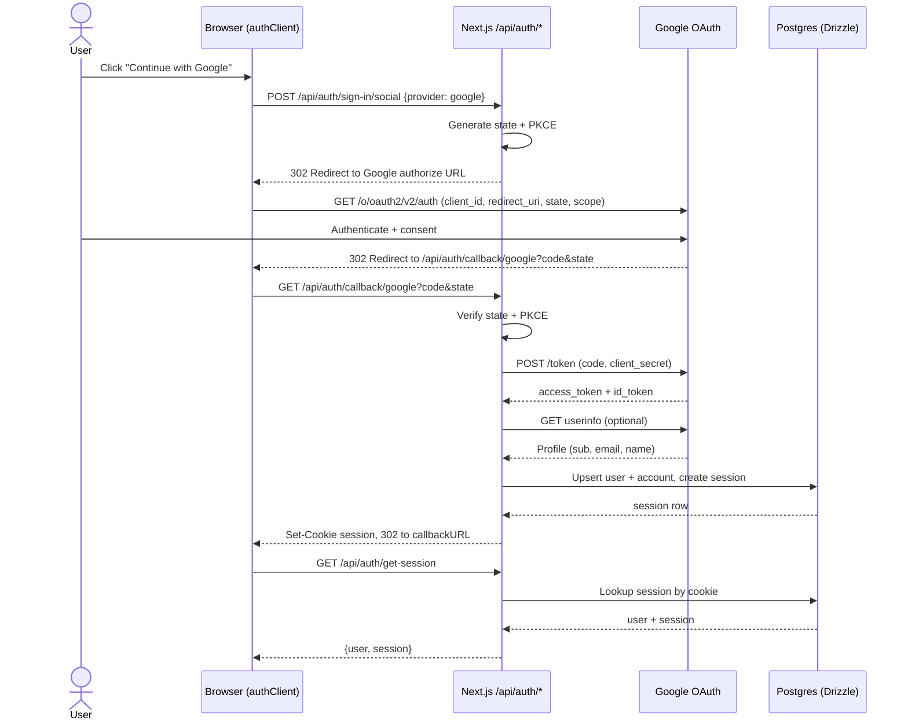

# OAuth (Google): usage and flow

## Production settings (required)

Set these values in production environment variables:

- `BETTER_AUTH_SECRET` (strong random secret, example: `openssl rand -base64 32`)
- `BETTER_AUTH_URL` (must be your public HTTPS app URL, for example `https://potrzebnik.pl`)
- `GOOGLE_CLIENT_ID`
- `GOOGLE_CLIENT_SECRET`
- DB vars (`DATABASE_URL` or `POSTGRES_*`)

OAuth provider redirect URIs (GCP):

- Authorized redirect URI (dev): `http://localhost:3000/api/auth/callback/google`
- Authorized redirect URI (prod): `https://potrzebnik.pl/api/auth/callback/google`
- If auth base path changes from `/api/auth`, update the callback URI accordingly.

Optional but important for multi-domain production setups:

- Use Better Auth dynamic `baseURL` with `allowedHosts`, or
- Add all allowed frontend origins to `trustedOrigins`
- Do not keep localhost origins in production `trustedOrigins`

## How to use it

1. Configure env:

```bash
cp .env.example .env
```

Set:

- `BETTER_AUTH_SECRET`
- `BETTER_AUTH_URL` (local: `http://localhost:3000`, prod: `https://potrzebnik.pl`)
- `GOOGLE_CLIENT_ID` and `GOOGLE_CLIENT_SECRET` (required in production; optional
  in local development if Google sign-in is not needed)
- DB vars (`DATABASE_URL` or `POSTGRES_*`)

2. In your OAuth provider settings, add redirect URI:

- `http://localhost:3000/api/auth/callback/google`

For production also add:

- `https://potrzebnik.pl/api/auth/callback/google`

3. Start services, migrate DB, run app:

```bash
bash startup_dev.sh
pnpm run db:migrate
pnpm run dev
```

4. Sign in from UI (client component):

```tsx
'use client';

import { authClient } from '@/lib/auth-client';

export function SignInWithGoogleButton() {
  return (
    <button
      onClick={() =>
        authClient.signIn.social({
          provider: 'google',
          callbackURL: '/dashboard',
        })
      }
    >
      Continue with Google
    </button>
  );
}
```

5. Read session in UI:

```tsx
'use client';

import { authClient } from '@/lib/auth-client';

export function AuthStatus() {
  const { data, isPending } = authClient.useSession();
  if (isPending) return <span>Loading...</span>;
  return data ? <span>{data.user.email}</span> : <span>Not signed in</span>;
}
```

6. Sign out:

```tsx
'use client';

import { authClient } from '@/lib/auth-client';

export function SignOutButton() {
  return <button onClick={() => authClient.signOut()}>Sign out</button>;
}
```

7. Protect server routes (example: dashboard layout):

```tsx
import { auth } from '@/lib/auth';
import { headers } from 'next/headers';
import { redirect } from 'next/navigation';

export default async function DashboardLayout({
  children,
}: {
  children: React.ReactNode;
}) {
  const session = await auth.api.getSession({
    headers: new Headers(await headers()),
  });

  if (!session) redirect('/');
  return <>{children}</>;
}
```



## How it works

1. `src/lib/auth-config.ts` creates Better Auth with Drizzle (`pg`) + Google provider.
2. `src/lib/auth.ts` creates the `auth` singleton using production DB.
3. `src/app/api/auth/[...all]/route.ts` mounts auth endpoints under `/api/auth/*`.
4. `src/lib/auth-client.ts` calls those endpoints from the browser.
5. `POST /api/auth/sign-in/social` validates Google login, creates/links user/account, creates session, sets cookie.
6. `GET /api/auth/get-session` reads cookie and returns session/user or `null`.
7. `POST /api/auth/sign-out` revokes session and clears cookie.
8. Data is persisted in tables: `user`, `account`, `session`, `verification`.

Official docs used:

- https://better-auth.com/docs/authentication/google
- https://better-auth.com/docs/reference/options
- https://better-auth.com/docs/reference/security
- https://better-auth.com/docs/guides/dynamic-base-url
- https://better-auth.com/docs/concepts/cookies
